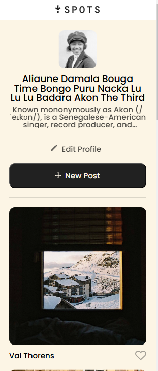
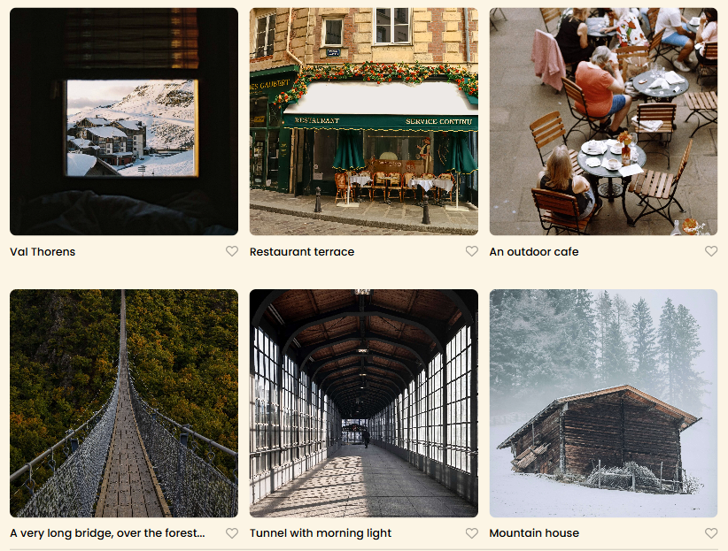
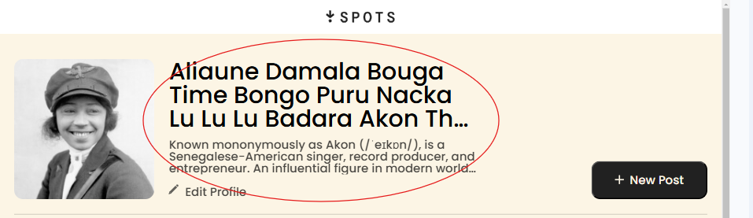

# Project 3: Spots

### Overview  

  This Project is called "Spots". In this project, I've created the layout of a mock social media website where people can create profiles, share pictures, and like one another's photos. This website is especially made for both desktop and mobile screen sizes.  

  
**Project Features**

- Semantic HTML5
- CSS
- BEM Methodology
- Flexbox
- Grid
- Responsive Design

  Using a combination of Grid and Flexbox, I was able to easily set up the website in a way that uses responsive design, ensuring that the website renders well on all screen sizes and resolutions. 

**Images**  

(Responsive Design makes viewing easy on mobile devices)
 
(Using Grid simplifies the process of creating space between photos)
 
(Text Overflow is handled)
